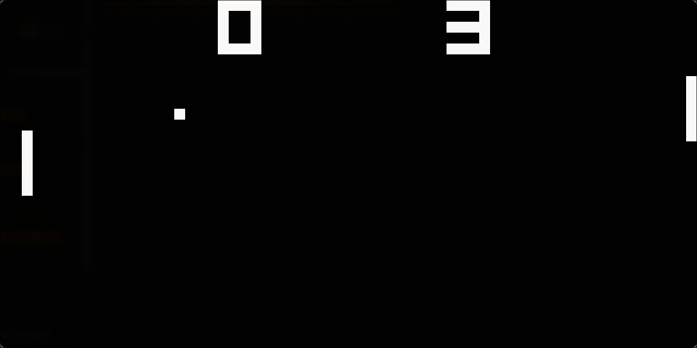

# Chip 8 Emulator
A simple CHIP-8 emulator written in C using the SDL3 library for graphics and input handling.

## 📁 Project Structure
chip8.c - Implements the CHIP-8 CPU, including instruction fetch, decode, and execution logic.  
main.c - Contains the main loop, SDL3-based graphics rendering, and input handling.  
vendored - Contains the SDL3 library.  
rom_test - Contains CHIP-8 test ROMs used for verifying instruction correctness.

**Sources:**
- https://github.com/corax89/chip8-test-rom  
- https://github.com/Skosulor/c8int  
- https://github.com/kripod/chip8-roms

## ▶️ To run the emulator locally
clone \<repo>\
cd \<repo>\
cmake -S . -B \<build name>\
cmake --build \<build name>\
run ./main.c "\<path-to-chip-8-rom>"

